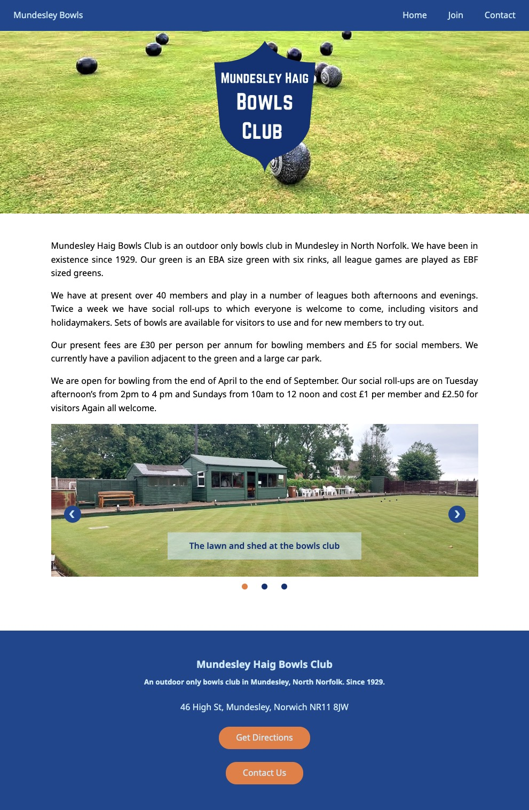

# React single page app

This is a website being built for a client using React. Built with Vite, React and TypeScript

## Table of contents

- [Overview](#overview)
  - [Installation](#installation)
  - [Functionality](#functionality)
  - [Screenshot](#screenshot)
  - [Links](#links)
- [My process](#my-process)
  - [Built with](#to-be-built-with)
  - [What I learned](#what-i-learned)
- [Author](#author)

## Overview

### Installation

# React App Setup Guide

This guide will help you download, install, and run this React application locally.

## Prerequisites

Make sure you have the following installed on your machine:

- [Node.js](https://nodejs.org/) (LTS version recommended)
- [Git](https://git-scm.com/)

## Getting Started

1. **Clone the Repository**  
   Open your terminal and run the following command to clone the repository:

   ```bash
   git clone <repository-url>
   ```

   Replace `<repository-url>` with the URL of this GitHub repository.

2. **Navigate to the Project Directory**  
   Change into the project's directory:

   ```bash
   cd <project-directory>
   ```

3. **Install Dependencies**  
   Install the required Node.js packages:

   ```bash
   npm install
   ```

4. **Start the Development Server**  
   Run the application in development mode:
   ```bash
   npm start
   ```
   This will start the app and open it in your default web browser.

## Additional Commands

- **Build for Production**  
  To create an optimized production build:
  ```bash
  npm run build
  ```

## Troubleshooting

If you encounter issues, ensure you have the latest version of Node.js and the necessary permissions to install dependencies. You can also check for specific errors in the terminal and refer to the [React documentation](https://reactjs.org/docs/getting-started.html).

### Functionality

Users should be able to:

- View a static web page that is responsive.
- Navigate the site using desktop and mobile menu designs.
- View and navigate through a slidehow on the homepage.
- Submit a message using the contact page.
- TODO: User authentication for protected access pages.
- TODO: Headless CMS for dynamic content that can be modified by the site owner.

### Screenshot

<div style='display: flex; flex-direction: row;'>
  
  
</div>

### Links

- [GitHub Repository](https://github.com/tomwinskell/bowls-frontend)
- [Live Demo](https://tomwinskell.github.io/bowls-frontend/)

## My process

### Built with

- [React](https://reactjs.org/) - JS library
- [Vite](https://vitejs.dev/) - A fast build tool and development server for modern web projects.
- [Emotion](https://emotion.sh/docs/introduction) - A performant and flexible CSS-in-JS library for styling applications.
- [EmailJS](https://www.emailjs.com/) - A service that allows you to send emails directly from your JavaScript code.
- [Fontsource](https://fontsource.org/) - A package that allows you to self-host fonts easily.
- [Wes Bos ESLint Config](https://github.com/wesbos/eslint-config) - A shareable ESLint config for JavaScript and React projects.
- Mobile-first workflow

### What I learned

In this project, I gained valuable experience in several areas:

1. **Creating a Slideshow in React**  
   Building a slideshow component was relatively straightforward. The biggest challenge was with styling to arrange elements appropriately and keeping track of the many components within the slideshow itself.

2. **Creating a Contact Form with EmailJS**
   Implementing a contact form that sends messages via EmailJS was also quite straightforward but new to me. I followed the EmailJS docs and researched the `useRef` hook in React. I learned the importance of using the `useRef` hook in React to store information that persists across renders. Modifying a `useRef` does not cause a re-render of the page.

3. **Exploring Emotion for Theming**  
   I would like to work more with Emotion to create themes, allowing for easier reuse of colors and styles across components. This will help maintain consistency in design and improve the overall maintainability of the code. Here’s a simple example of how to define a theme with Emotion:

   ```javascript
   /** @jsxImportSource @emotion/react */
   import { css } from '@emotion/react';

   const theme = {
     colors: {
       primary: '#0070f3',
       secondary: '#1c1c1c',
     },
   };

   const buttonStyle = css`
     background-color: ${theme.colors.primary};
     color: white;
     padding: 10px 20px;
     border: none;
     border-radius: 5px;
   `;
   ```

Overall, these experiences have enhanced my understanding of React components, state management, and styling techniques.

## Author

- Frontend Mentor - [@tomwinskell](https://www.frontendmentor.io/profile/tomwinskell)
- [LinkedIn](https://www.linkedin.com/in/tomwinskell) - Professional network and career connections.
- [Notion](https://tomwinskell.notion.site) - Personal workspace and knowledge management.
- [GitHub](https://github.com/tomwinskell) - Check out my projects and code repositories.
